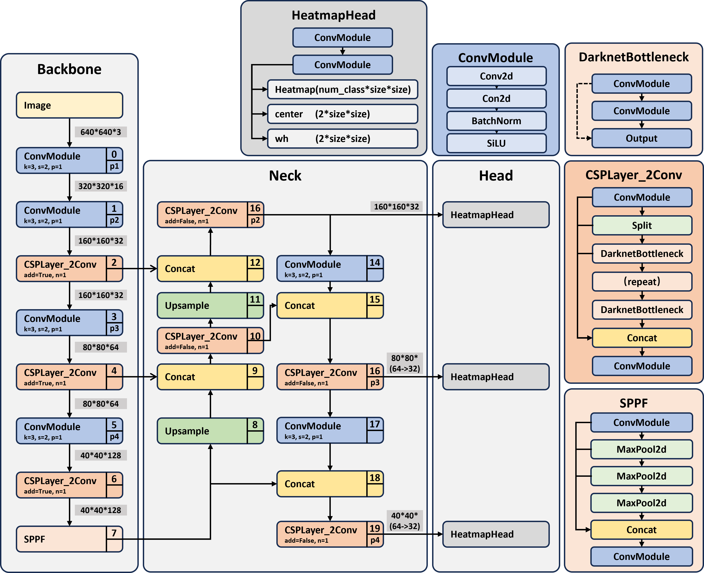
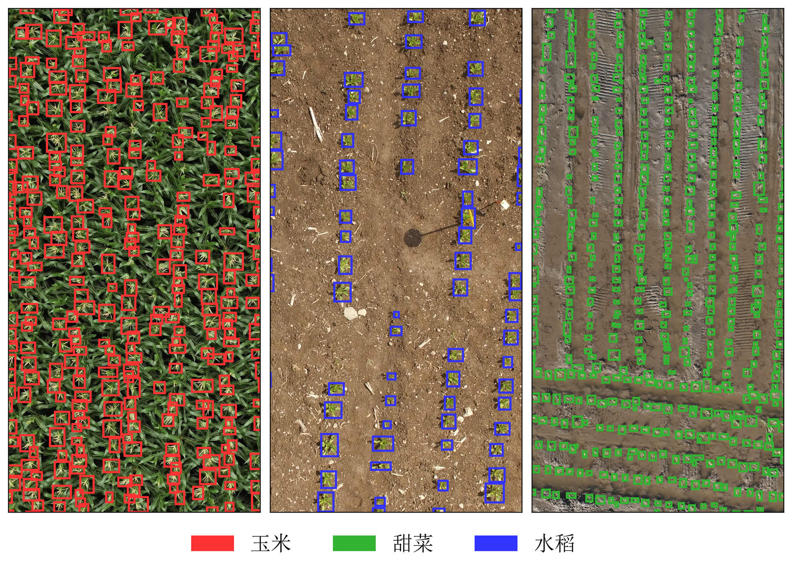

# 基于 YOLO 的植株计数方法构建及部署

本科毕设项目。

基于 YOLOv8n 轻量骨干与 CenterNet 风格中心点热力图检测头的无人机航拍植株计数方法，支持高分辨率滑窗推理与 Jetson Nano 边缘部署。

## 目录

```
scripts/
├── model.py              # HeatmapYOLO — 特征提取 + 三尺度热力图检测头
├── train.py              # 训练流程 (EMA / AMP / AdamW / Cosine LR)
├── loss.py               # Focal Loss + L1 中心偏移 + L1 宽高回归
├── dataset.py            # 数据加载、增强与多尺度高斯热力图标签生成
├── eval.py               # 小图测试集评估 (Precision / Recall / F1 / MRE)
├── config.py             # 训练与推理配置
├── infer_utils.py        # 兼容旧导入
├── predict.py            # 单图 / 批量推理
├── deploy/
│   └── predict.py        # Jetson Nano TensorRT 推理 (滑窗 / 融合 / 解码)
├── experiment/           # 实验脚本 (复杂度 / 性能 / 消融 / 泛化 / 绘图)
├── utils/                # ONNX 导出、标注可视化、热力图绘制等工具
├── yolov8n_p234.yaml     # P2/P3/P4 模型配置 (stride 4/8/16)
└── yolov8n_p345.yaml     # P3/P4/P5 模型配置 (stride 8/16/32)
```

## 方法简介

| 环节 | 说明 |
|------|------|
| 数据集 | 水稻、甜菜、玉米三类作物，ExG 颜色分割 + YOLOv8s 辅助的半自动标注 |
| 模型 | YOLOv8n Backbone → FPN/PAN → P2/P3/P4 → 1×1 通道压缩 → 三尺度热力图检测头 |
| 检测头 | 每尺度输出 7ch：3ch 类别热力图 + 2ch 中心偏移 + 2ch 宽高 |
| 损失 | Focal Loss (α=2, β=4) + L1 偏移 + 0.1·L1 宽高，三尺度加权 (1.0, 0.3, 0.1) |
| 推理 | 滑窗 1024×1024 → 特征图融合 → 峰值解码 → 中心距离抑制 (12px) |
| 部署 | 结构剪枝 → ONNX → TensorRT FP16 → Jetson Nano |

## 核心结果

| 指标 | 数值 |
|------|------|
| 参数量 | 0.70 M |
| 权重大小 | 2.81 MB |
| F1 (小图测试) | 0.932 |
| MRE | 0.114 |
| Jetson 延迟 | 88.3 ms |
| 计数准确率 (部署) | 94.5% |

## 关键图示

### 模型总体架构



### 三类作物标注示例



## 使用

```bash
# 训练
python scripts/train.py

# 评估
python scripts/eval.py

# 推理 (单图 / 批量)
python scripts/predict.py

# Jetson Nano 部署推理
python scripts/deploy/predict.py
```

训练配置和模型变体切换见 `scripts/config.py`。

## 依赖

Python 3.8+ · PyTorch 1.11+ · Ultralytics 8.0 · OpenCV · NumPy · SciPy  
Jetson Nano: JetPack 4.6 · TensorRT 8.2 · CUDA 10.2 · PyCUDA

## 致谢

论文排版使用 [universal-hit-thesis](https://github.com/hitszosa/universal-hit-thesis) 模板。
